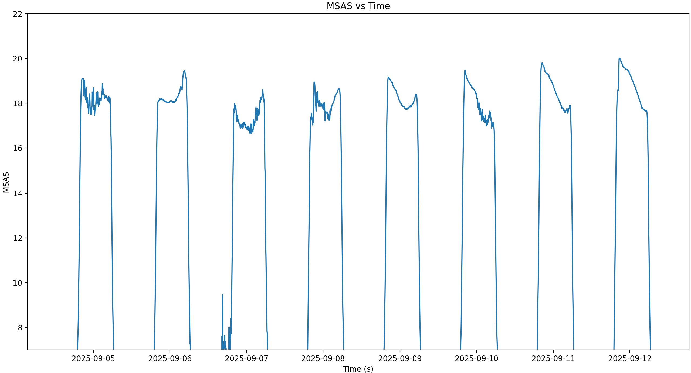
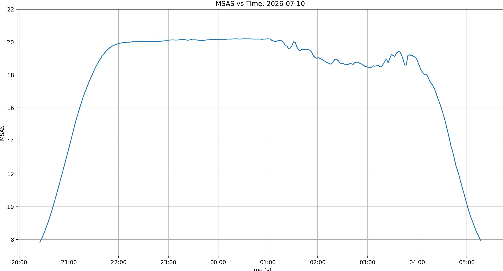
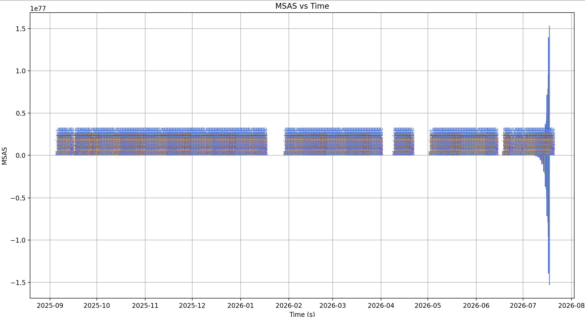
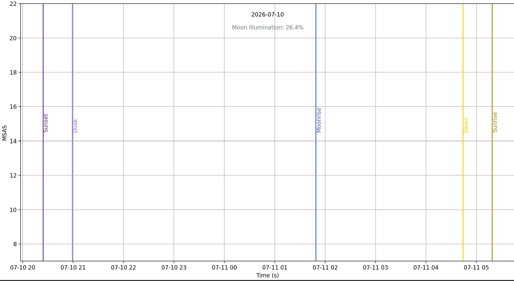
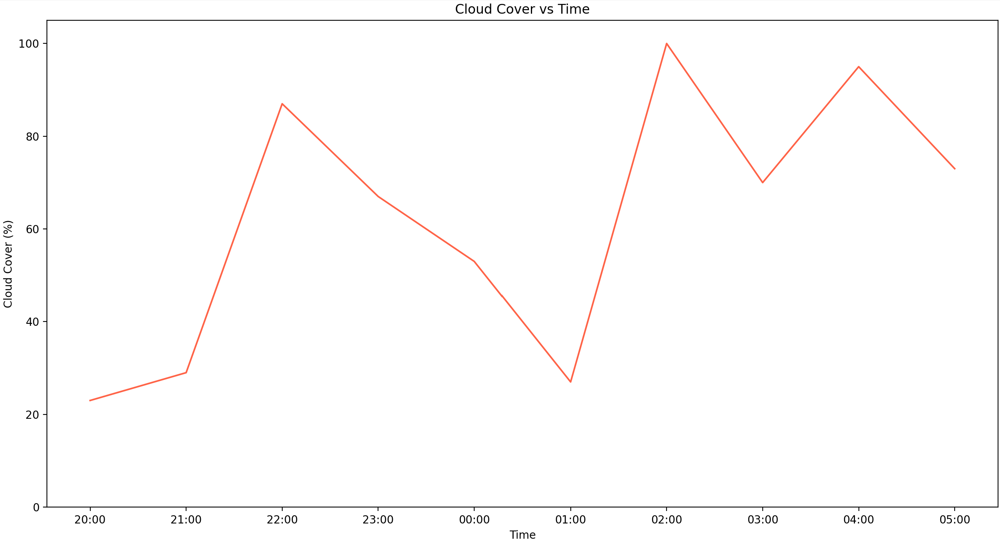
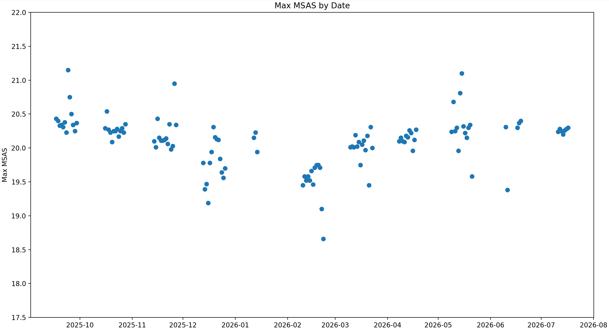
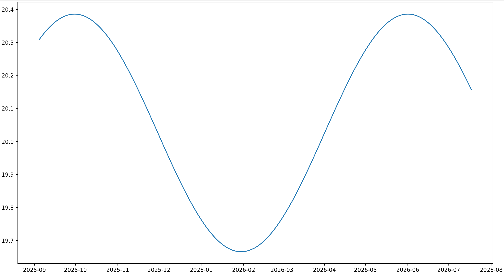
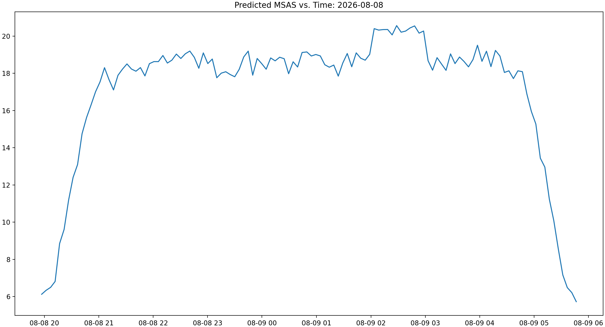
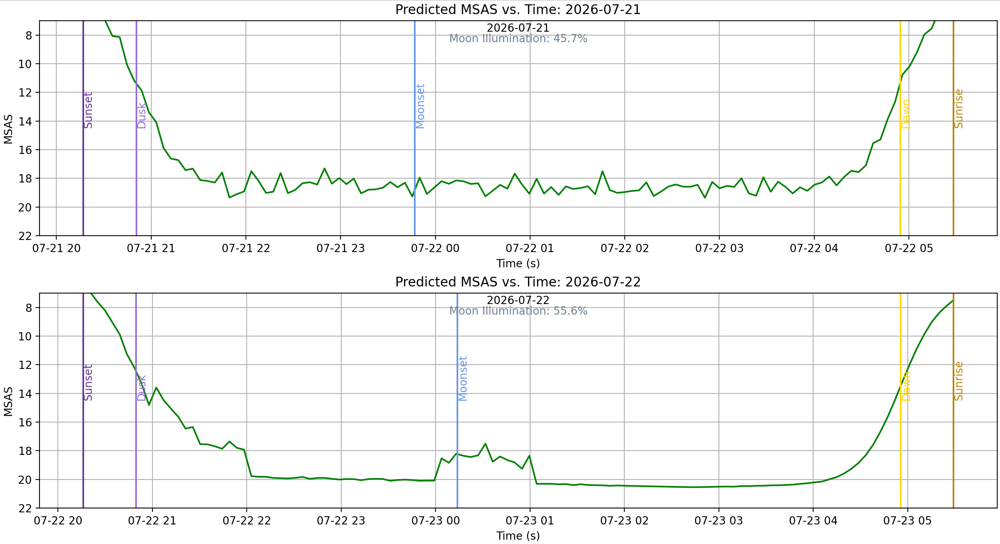
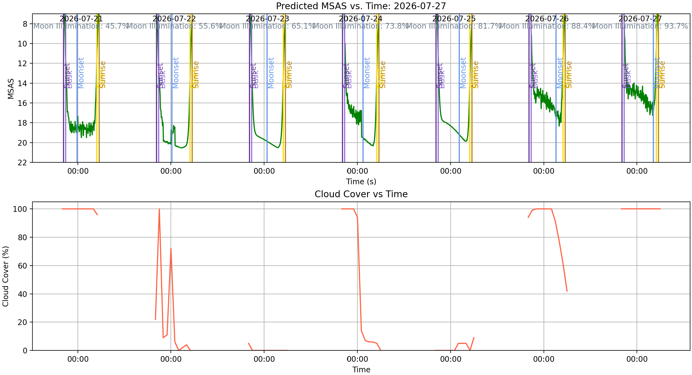

# Sky Quality Data Plotting (SDP)


This repository is produced and managed by the Wallace Astrophysical Observatory (WAO) at the Massachusetts Institute of Technology (MIT).

This library can be used to graph, interpret, and predict sky quality data. Features include:
- Graphing data from **Sky Quality Meter (SQM)** devices.
- Overlaying **weather and lunar data** to understand their effect on sky quality.
- Seeing change in sky quality over longer periods of time.
- **Predicting sky quality** for dates in the future based on weather, lunar data, and other factors.

## Using SDP directly

1. Download SDP and ensure that dependencies are installed.
2. Run `driver.py`. SDP automatically provides terminal prompts that will run frequently used commands. Follow the terminal prompts to generate your desired graph.
3. If your chosen graph is not included in the default options in the terminal prompt menu, you can **use the command line to generate a custom graph**. In the terminal menu, choose  `Open command line.` and use the command formatting instructions (found further down in this README) to generate a graph.

## Using SDP as a library
1. To use SDP as a library in your own code, start by importing **both** `driver.py` and `graph.py`. 
2. Run the `read_file()` method from `driver.py` to upload and interpret SQM data files and populate the dataset. 
    - Alternatively, you can populate the dataset yourself by importing `parse.py` and directly manipulating the datset variables (`time_utc`, `time_local`, `temp`, `count`, `freq`, and `msas`). If you choose this option, you must also import `weather.py` and call `weather.update_all_weather()` once the dataset has been populated. Lastly, you must include the following line: `graph.timeFormat = graph.update_time_format()`.
3. Write a command according to the command formatting instructions found further down in this README.
4. Pass your command on to the `graph()` method in `graph.py`.

Example implementation (recommended method):
```python
import driver
import graph

driver.read_file()
cmd = 'raw-individual%date=2026/07/21 OVERLAY markers-individual%date=2026/07/21&invert SPLIT weather%date=2026/07/21&grid'
graph.graph(cmd)
```

# Command Formatting

## Command Base
The most important part of each command is the base, whch selects which type of graph to generate. Current available bases are:
- `raw-all`: Graphs MSAS vs. time for every point in the dataset.

  

  Above: Generated with command: `raw-all` on a small dataset

- `raw-individual`: Graphs MSAS vs. time for a single date (you must specify which date: see qualifiers section for more info)

  
  
  Above: Generated with command: `raw-individual%date=2026/07/10`

- `markers-all`: Graphs sun and moon event markers (i.e. dusk, dawn, sunrise, sunset, moonrise, and moonset) for every date in the dataset. Includes text displaying the moon illumination and date. **Note that this is not an especially useful graph on its own and is intended to be overlaid on `raw-all`.**

  
  
  Above: Generated with command: `markers-all` on a large dataset

- `makers-individual`: Graphs sun and moon event markers (i.e. dusk, dawn, sunrise, sunset, moonrise, and moonset) for a single specified date. Includes text displaying the moon illumination and date. **Note that this is not an especially useful graph on its own and is intended to be overlaid on `raw-individual`.**

  
  
  Above: Generated with command: `markers-individual%date=2026/07/10`

- `weather`: Graphs cloud cover vs. time for a single specified date.

  
  
  Above: Generated with command: `weather%date=2026/07/01`

- `sinusoidal`: Graphs maximum MSAS on each night in the dataset (dubbed 'sinusoidal' because it should form a rough sinusoid!)

  
  
  Above: Generated with command: `sinusoidal`

- `sinfit`: Graphs a sinusoid fit to the maximum MSAS on each night.

  
  
  Above: Generated with command: `sinfit`

- `prediction`: Graphs predicted data for a specified date.

  
  
  Above: Generated with command: `prediction%date=2026/08/08`

## Qualifiers
Qualifiers are intended to be used to make specifications about an individual command base. If multiple graphs are overlaid on top of each other, qualifiers should be included for each one (unless no qualifiers are needed!). Qualifiers are marked by the `%` key.

Qualifiers currently include:
- `%date={date}`: Specifies the date to graph in YYYY/MM/DD format for command bases that require a specified date. Example: `weather%date=2026/07/10`
- `%color={color}`: (**always optional**) Specifies what color to make the graph. Colors are strings and any color accepted by matplotlib.pyplot may be used (see below).
  
- `%consider_date={boolean value}`: **Used for `prediction` base only** Whether to consider annual sinusoidal effect when making prediction. Defaults to True, so it is only necessary to specify a value if it is desired to be "False". Example: `%consider_date=False`
- `%consider_moon={boolean value}`: **Used for `prediction` base only** Whether to consider the moon's presence when making prediction. Defaults to True, so it is only necessary to specify a value if it is desired to be "False".
- `%consider_clouds={boolean value}`: **Used for `prediction` base only** Whether to consider cloud cover when making prediction. Defaults to True, so it is only necessary to specify a value if it is desired to be "False".
- `%filter={filter}`: Two of the base commands allow the user to filter out bad data. Both data filters default to off.
    - For `raw-all`: Filter is a **string**. `'by value'` removes data points where MSAS is below the threshold `graph.msas_night_threshold` (can be set/specified by user, defaults to 17.0). `'by dawn/dusk'` removes values whose timestamps are *not* between dusk and dawn. `'none'` is the default and applies no filter.
    - For `sinusoidal`: Filter is a **boolean value**. When set to `True`, data points from nights with a bright moon will be removed.

## Combining graphs
There are two keywords that can be used to create an image consisting of multiple graphs.

1. `OVERLAY` is used to overlay multiple datasets on the same axes.
2. `SPLIT` is used to create a second set of axes.

Until the `SPLIT` keyword is used or the command ends, `OVERLAY` will continue adding data onto the same set of axes (i.e. more than two things can be overlaid).

Example: `prediction%date=2026/07/21%color=green OVERLAY markers-individual%date=2026/07/21&invert&grid SPLIT prediction%date=2026/07/22%color=green OVERLAY markers-individual%date=2026/07/22&invert&grid`

This command is the equivalent of saying:
- Graph 1: Overlay `markers` on `prediction` data for July 21st, 2026
- Graph 2: Overlay `markers` on `prediction` data for July 22nd, 2026

The following graph will be created:
  

*Note: The same graph could also be created with the slightly shorter command: `prediction%date=DATE%color=green OVERLAY markers-individual%date=DATE&invert&grid#repeat=2#start=2026/07/21#mode=s`*

## Graph settings
Unlike qualifiers, which can be used on each individual dataset before it gets overlaid, settings are used for an entire graph. Settings are defined by the `&` keyword.

- `&invert` flips the y-axis upside down. This can be helpful in making graphs of sky quality more intuitive (lower = darker).
- `&grid` enables a grid.
- `&sharex` makes all graphs share the same x-axis scaling. This will apply to the current graph and all graphs preceding it in the command (where graphs are defined by the `SPLIT` keyword).

## Graphing multiple nights in one command
It may be helpful to graph data for several consecutive nights. While one could just write a really long command to do this, the `#repeat` command is intended to be used for this exact purpose! Repeat commands are formatted as follows and placed at the end of the portion of the command to be repeated:

`#repeat={num}#start={date}#mode={mode}`

Where:
- `num` = Number of consecutive dates to graph data for.
- `date` = Start date
- `mode` = Either 's' (for SPLIT mode) or 'o' (for OVERLAY mode)

Example 1: `prediction%date=DATE%color=green OVERLAY markers-individual%date=DATE&invert&grid#repeat=5#start=2026/07/21#mode=s`

This command will create 5 different graphs, spanning from 7/21/2026-7/25/2026, each with `markers-individual` overlaid on `prediction`.

Example 2: `prediction%date=DATE%color=green OVERLAY markers-individual%date=DATE&invert&sharex#repeat=7#start={date}#mode=o SPLIT weather%date=DATE#repeat=7#start=2026/07/21#mode=o`

This command will show 7 days of data for the week beginning on 7/21/2026. All of the predictions will be shown on the same graph, while all of the weather data will be shown on a separate graph, as seen below.

  

**IMPORTANT NOTE: In order for the repeat command to work, all `%date={date}` qualifiers MUST be replaced by `%date=DATE` as seen in the examples above!**